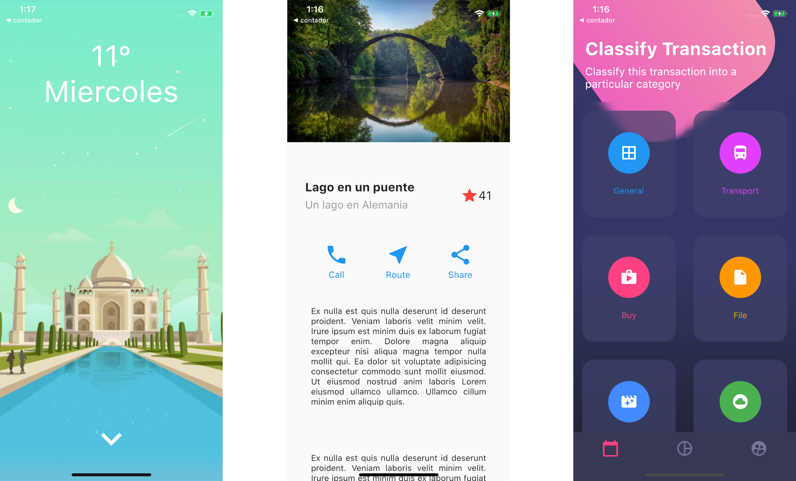

# Designs

A basic flutter project to improve design skills.
This is a practice excercise from Flutter: Tu guía completa de desarrollo para IOS y Android created by Fernando Herrrera

- basic_screen
- dashboard_screen
- scroll_screen 



## Getting Started

```
flutter get packages
```
```
flutter run
```
